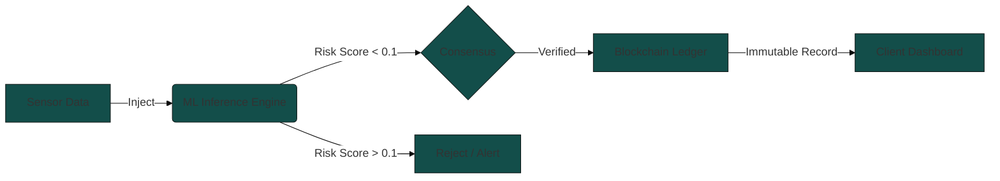

<div align="center">
  <br />
  <br />
  <h3>M E D I T R A C E</h3>
  <br />
  <p>
    Immutable Pharmaceutical Logistics.<br>
    Powered by <b>Machine Learning</b> & <b>Ethereum</b>.
  </p>
  <br />
  <code>Next.js 16</code> &nbsp;•&nbsp; <code>Flask</code> &nbsp;•&nbsp; <code>Solidity</code> &nbsp;•&nbsp; <code>Docker</code>
  <br />
  <br />
  <br />
</div>

## — Overview

**MediTrace** is a cryptographic supply chain registry designed to eliminate counterfeit pharmaceuticals. By fusing on-chain immutability with off-chain ML risk assessment, it provides a tamper-proof audit trail for sensitive logistics.

<div align="center">

| **Inference** | **consensus** | **Interface** |
| :--- | :--- | :--- |
| `Random Forest` | `Ganache-CLI` | `Next.js / React 19` |
| `Isolation Forest` | `Smart Contracts` | `Tailwind CSS` |
| `Scikit-learn` | `Solidity 0.8` | `Glassmorphism` |

</div>

<br />

## — Architecture

The system operates as a unified protocol where physical sensor data is validated by AI before being permanently sealed on the blockchain.



<br />

## — Quick Start

Ready in **~2 minutes**. Requires Docker.

```bash
# 1. Clone
git clone https://github.com/chamaththiwanka/MediTrace.git && cd MediTrace

# 2. Build & Launch (seeds demo users automatically)
docker compose up --build
```

> **That's it.** The `seeder` service waits for the web app to be healthy, then seeds all demo accounts automatically. No separate commands needed.

<div align="center">
  <br />
  <a href="http://localhost:3000"><b>Launch Dashboard →</b></a>
  <span style="color: #666">&nbsp;&nbsp;&nbsp;|&nbsp;&nbsp;&nbsp;</span>
  <a href="http://localhost:5000"><b>ML API →</b></a>
  <br />
  <br />
</div>

### Demo Accounts

| Role | Email | Password |
| :--- | :--- | :--- |
| **Manufacturer** | `manufacturer@meditrace.com` | `manufacturer123` |
| **Admin** | `admin@meditrace.com` | `admin123` |
| **Consumer** | `consumer@meditrace.com` | `consumer123` |


## — Capabilities

| Feature | Spec |
| :--- | :--- |
| **Prediction** | Dual-stage `Random Forest` + `Isolation Forest` pipeline for measuring logistical risk. |
| **Trust** | SHA-256 data hashing anchored on a local Ethereum testnet. |
| **Speed** | Sub-100ms inference latency with optimistic UI updates. |
| **Storage** | Hybrid `MongoDB` (metadata) + `Blockchain` (proofs) architecture. |

<br />

## — Endpoints

Core API surface area for the inference engine.

<details>
<summary><code>POST /predict</code></summary>
<br />

**Payload**
```json
{
  "route_efficiency": 85,
  "temperature_avg": 4.0,
  "vibration_shock": 1.2
}
```

**Response**
```json
{
  "risk_score": 0.02,
  "status": "OK",
  "prediction": 0
}
```
</details>

<details>
<summary><code>GET /metrics/:id</code></summary>
<br />

Retrieves generated artifacts from the data science lab (e.g., `feature_importance.png`, `confusion_matrix.png`).
</details>

<br />

---
</div>
